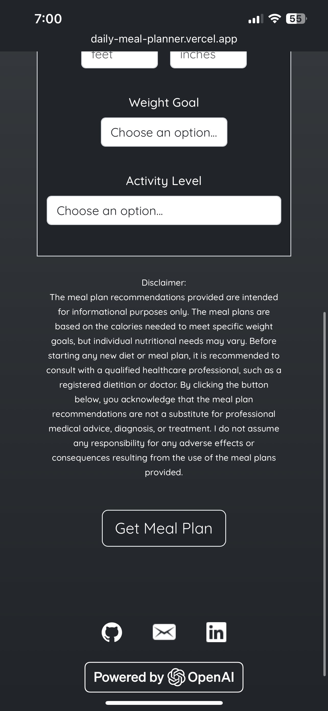

# Daily Meal Planner

  
  
  
   
  
  

 

A web app that generates personalized daily meal plans based on a user’s calorie goal.  
It calculates calorie needs using the [**Harris-Benedict equation**](https://en.wikipedia.org/wiki/Harris%E2%80%93Benedict_equation) and then generates a customized meal plan using the **OpenAI API** (Mini 5 model).  

---

## Key Features
- Personalized daily meal plan generation using the OpenAI API  
- Calorie goal calculation using the Harris–Benedict formula  
- Responsive web design with Bootstrap for mobile and desktop  
- Input validation and calorie calculation workflow 
- Deployed to Vercel for cloud hosting and live access 

---

## How It Works
1. User enters personal data (age, weight, height, activity level, and weight goal).  
2. Python script calculates daily calorie target using the Harris–Benedict formula.  
3. Calorie target is inserted into a structured `messages` array for OpenAI API.  
4. Mini 5 model generates a full daily meal plan (recipes, ingredients, and calories).  
5. Meal plan is displayed in the responsive Flask + Bootstrap web app.
---

## Tech Stack
  
  
  
   
  
  

---

## Live Website
[Daily Meal Planner on Vercel](daily-meal-planner.vercel.app)

---

## About This Project
This project was created to practice **full-stack development, working with REST APIs, AI integration, and web deployment**. It demonstrates:  
- Writing Python scripts to calculate daily calorie targets using the **Harris–Benedict formula** based on user inputs    
- Integrating the **OpenAI Chat Completions API (Mini 5 model)** to generate daily meal plans  
- Using **prompt engineering** to fine-tune AI-generated outputs  
- Building a responsive web interface with **Flask, Jinja2 templates, and Bootstrap**  
- Deploying a production-ready web app on **Vercel**

---
  

>**Disclaimer**  
The meal plan recommendations provided are intended for informational purposes only. The meal plans are based on the calories needed to meet specific weight goals, but individual nutritional needs may vary. Before starting any new diet or meal plan, it is recommended to consult with a qualified healthcare professional, such as a registered dietitian or doctor. By clicking the button below, you acknowledge that the meal plan recommendations are not a substitute for professional medical advice, diagnosis, or treatment. I do not assume any responsibility for any adverse effects or consequences resulting from the use of the meal plans provided.
